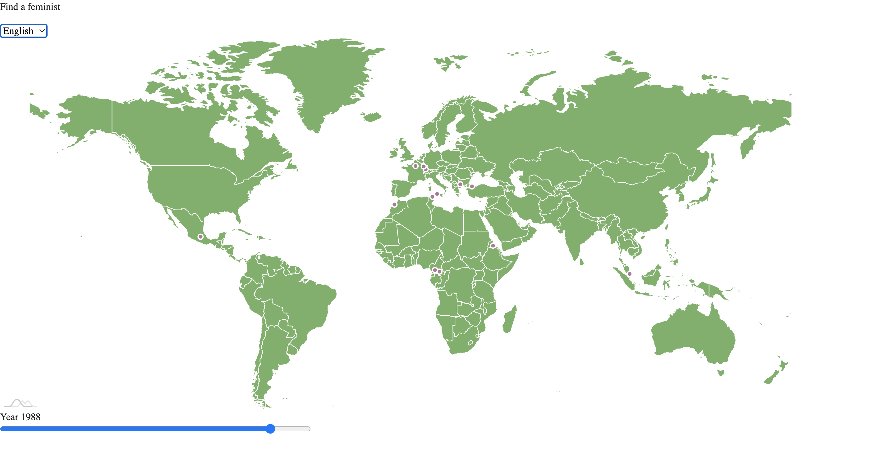

# femiwhere

[Link to the map](https://alexandresi.github.io/femiwhere/)

Looking for someone inspiring, fighting against patriarchy? This might be the one project to search into.

## Help us build this map

If you want to:

- Add people that you feel should appear on this map, [click here](https://github.com/AlexandreSi/femiwhere/issues/new/choose)
- Request for modifications, or even contribute to the design/the coding aspect of this project, please open an issue or a Pull Request!

Note: The list of people already correspond to the list of files [here](https://github.com/AlexandreSi/femiwhere/tree/main/js/feminists)
